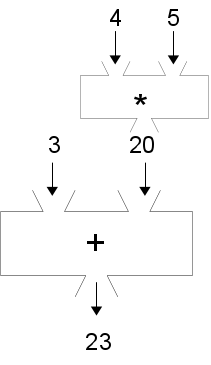
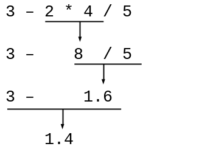
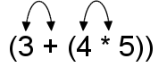

..  Copyright © J David Eisenberg
.. |---| unicode:: U+2014  .. em dash, trimming surrounding whitespace
   :trim:

Doing More Than One Operation
:::::::::::::::::::::::::::::

What if you want to write ``3 + 4 * 5`` in ClojureScript? A function box diagram of this expression
looks like this:
    

   
   Two operations as function boxes

There are two ways to translate an arithmetic expression from its normal **infix** (operator between the operands) notation to
ClojureScript’s **prefix** (operator before the operands) notation: the logical, abstract thinking method and the mechanical,
no-thinking method.

Expressions: The Abstract Thinking Method
=========================================

What’s Really Going On?
-----------------------

As you saw from the function box diagram, ``3 + 4 * 5`` means to add 3 to the result of multiplying 4 times 5.
(That’s the order because multiplication is more important than division. This is referred to as *precedence of operations*.)

To add 3 to something in ClojureScript, you write:
    
::

    (+ 3 something)

That *something* is the result of multiplying 4 times 5, which you write as ``(* 4 5)``\. Putting it together, you get:

::

    (+ 3 (* 4 5))

Notice that the order of operations is inverted |---| the last operation you do in infix notation (addition) becomes the first
prefix operation.

Here’s another example: ``3 - 2 * 4 / 5``\. Thinking it through in order of operations:

   
   Order of evaluation for 3 - 2 * 4 / 5

Keeping in mind that the last shall be first, and the first shall be last, the answer is:
    
::

    (- 3 (/ (* 2 4) 5))

Expressions: The Mechanical Method
==================================

Let’s return to the expression ``3 + 4 * 5``\. Fully parenthesize the expression, which gives you
``(3 + (4 * 5))``\. Then switch the first operand and the operator within each set of parentheses.

   
   Switching operator and operand
   
That gives you this result:
    
::

    (+ 3 (* 4 5))

As before, the order of operations is inverted; the last operation you do in infix notation (the addition) becomes
the first prefix operation.

Here is the other example: ``3 - 2 * 4 / 5``. Using what you know about order of operations and *fully*
parenthesizing the expression, you apply these steps:
    
::

    (3 - ((2 * 4) / 5))     ; fully parenthesize
    (- 3 ((2 * 4) / 5))     ; switch 3 and minus sign
    (- 3 ((* 2 4) / 5))     ; switch 2 and multiplication symbol
    (- 3 (/ (* 2 4) 5))     ; switch (* 2 4) and division symbol
    
No, I have not pulled a fast one on you with that last step. I really am following the
rule: I switched the operator (the division) with the *first operand* of the division,
which, in this case, was ``(* 2 4)``.

Now it’s your turn to give it a try on the next page.
