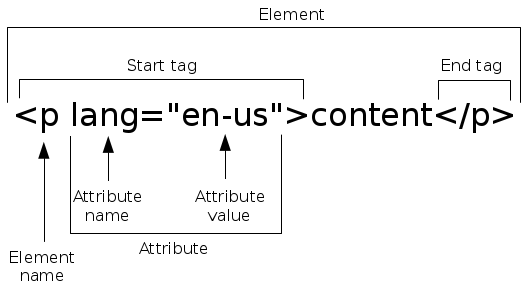

..  Copyright © J David Eisenberg
.. |---| unicode:: U+2014  .. em dash, trimming surrounding whitespace
   :trim:

Appendix A: Basics of HTML
::::::::::::::::::::::::::::::

Since ClojureScript is designed to work with web pages, you wil need to know the basics of HTML |---| the language of web pages.

This appendix gives an extremely abbreviated summary of HTML; you will learn just enough to write pages that can interact with ClojureScript, or, to put it another way, you will know enough to be dangerous.

Structure of an HTML Document
===============================

Normally, a web page lives in a file in the form of an HTMl document. The structure of an HTML document is a lot like the structure of a business letter. Business letters have:
    
* a letterhead, telling the name of the business
* a heading, giving information about the date, sender, and receiver
* the body, giving the content of the letter
* the closing

An HTML document contains:
    
* a ``<!DOCTYPE html>`` directive to identify the document as HTML5 (HTML version 5)
* a ``<html>`` element that starts your web page. Inside this element will be:
    
  * a ``<head>`` element that identifies the document title and other information about the document as a whole, and
  * a ``<body>`` element that contains the document content

(There is no equivalent of a business letter’s closing.)

The Elements of HTML
=====================

Both the head and body of a web page are composed of HTML *elements*, which are directives that tell the browser how to display the page.
An element consists of an opening *tag*, the element content, and the closing tag. An opening tag consists of a less than symbol, the element name, and a greater than symbol. For example, the ope
A closing tag consists of a less than symbol, a slash, the element name, and a greater than symbol.

That’s terribly abstract, so here is an example:
    
::
    
    <p>This is a paragraph.</p>
    
The preceding example is a ``<p>`` element. The opening tag is ``<p>``, the clsoing tag is ``</p>``, and the content is  ``This is a paragraph.`` (Documentation about an element will usually be written using the opening tag, as I have done here.)

This is a ``<strong>`` element.

::    
    
    <strong>important stuff</strong>

It tells the browser that the content should be “strongly emphasized,“ which, in most browsers, means to display the content in boldface. 

.. note::
    
    You will also sometimes see opening tags referred to as start tags or beginning tags; closing tags are also called end tags or ending tags.

Opening and Closing Tags
---------------------------
Some HTML elements require closing tags, some don’t. The ``<p>`` element does not need a closing tag; in the following example, the browser realizes that when the second paragraph begins, the content of the first one must have ended:

::
    
    <p>
       Paragraph one.
    <p>
       Paragraph two.

The ``<strong>`` element, on the other hand, *must* have a closing tag; otherwise, the browser wouldn’t know when to turn off boldface and return to normal text.

While I could give you a list of HTML elements that don’t require closing tags, it’s easier to follow this rule: *always* use a closing tag. Then you won’t have to waste neurons wondering whether the current element requires the closing tag or not.

Empty elements
------------------
Both ``<p>`` and ``<strong>`` will ordinarily have content between the opening and closing tags. There are some HTML elements that *never* have content. Here are three of them:
    
* ``<br>``, which tells the browser that the following content belongs on the next line
* ````, which tells the browser to display an image
* ``<input>``, which tells the browser to display a text area on the screen for user input

While you can write these elements this way: ``<br></br>``, ``</img>``, and ``<input></input>``, because the elements will never have any content, there’s a shortcut:
    
* ``<br/>``
* ````
* ``<input/>``

You can think of the ``<.../>`` as meaning “this is an opening and closing tag all wrapped up in one.”

Nesting Elements
------------------

It is possible to have elements within elements.  The following example shows an ``<em>`` (emphasized text, usually shown in italics) inside a
``<strong>`` (strongly emphasized, bold) element inside a ``<p>`` (paragraph).

.. activecode:: nesting
    :language: html
    :autorun:
    
    <p>
    This paragraph has
    <strong>very <em>important</em> text</strong>
    within it.
    </p>

When you nest elements, the inner element must be completely within the outer element. The following elements are not nested properly, because
the outer ``<strong>`` element ends before the inner ``<em>`` does.
    
::
    
    <strong>opening <em> and closing tags </strong> "cross over" one another</em>

Although browsers will display incorrectly nested elements (and they even have a standard for how to handle them), it is considered bad form to write it wrong.


Block vs. Inline Elements
---------------------------

Some elements, like ``<p>``, begin a new line. These are referred to as *block elements*.  Others, like ``<strong>`` and ````, do not begin a new line, and are called *inline elements*. This has been a public service announcement for your information; in case you see these terms, now you will know what they mean.

Attributes
============
That ```` element is woefully incomplete. It tells the browser to display an image |---| but which image? From what file? What size? What alternate text (for screen readers used by visually impaired people)?  You use *attributes* to specify this extra information.  Here is a more complete ```` element:
    
::
    
    
      
Each attribute consists of an attribute name (``src``), an equal sign, and then the attribute value in quote marks. You may use either single quotes or double quotes. So, the preceding example shows a single element with six attributes:
    
* ``src``: the path to a file containing the image;  in this case ``pics/marco.jpg``
* ``id``: a unique identifier for this element
* ``width`` and ``height``: the display dimensions for the image
* ``alt``: the text that screen readers should use; this is usually a description of what the image shows
* ``title``: text that appears when the user hovers the mouse over the image

If you think of HTML elements as verbs (“start a paragraph”, “show an image”), you can think of attributes as adverbs that tell a verb *how* to do its job.

While you can sometimes leave off quote marks on an attribute value, it’s not worth my time to explain the rule or your time to memorize it. Always put quote marks around the attribute values, and it will always be correct.

The ``id`` Attribute
------------------------

When you are using ClojureScript to manipulate a web page, you will usually use the ``getElementById`` function to access an HTML element by its ``id`` attribute. The value of an ``id`` cannot contain spaces, but may contain any other character. To interact better with CSS (see :doc:`Appendix B </appendix_b>`), you would be well advised to use only letters, digits, underscores, and hyphens for your ``id``\ s.

Summary
---------

Here is a diagram that summarizes the terminology for elements and attrbutes.



Common Elements
=================

Here are some of the more commonly used elements:

* ``<p>``: paragraph
* ``<div>``: “division” (logical section) of the document; this is a block element.
* ``<ul>``: unordered (bulleted) list
* ``<ol>``: ordered (numbered or lettered) list
* ``<li>``: list item (appears within an unordered or ordered list)
* ``<br/>``: line break
* ``<input/>``: user input. Attributes tell you whether the input area is:
    
  * ``type="text"`` one-line text area
  * ``type="radio"``: radio button
  * ``type="checkbox"``: check box
  * ``type="button"``: labeled button

* ``<h1>``, ``<h2>``...\ ``<h6>``: headings; ``<h1>`` is a level one head; ``<h6>`` is level six. The smaller the level number, the larger the size.
* ````: image
* ``<em>``: emphasized text; usually displays as italic
* ``<strong>``: strongly emphasized text; usually displays as bold
* ``<a>``: anchor; used for links with the ``href`` attribute
* ``<pre>``: “preformatted” text; block element usually used for multi-line code samples
* ``<code>``: inline element used for code samples
* ``<span>``: inline element used to mark a part of content; usually used with styles

