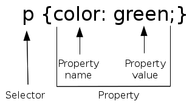

..  Copyright © J David Eisenberg
.. |---| unicode:: U+2014  .. em dash, trimming surrounding whitespace
   :trim:

Appendix B: CSS (Cascading Style Sheets)
::::::::::::::::::::::::::::::::::::::::::::::

In :doc:`Appendix A </appendix_a>` you got a brief introduction to HTML. If you make a web page using these tags, you can communicate your content, but it will look very plain. If you want your pages to look better aesthetically, you will want to style your pages. For example, you may want all ``<strong>`` text to show up in red, or you might want all your level one headings (``<h1>``) to be italic in Garamond font. 

To do this, you use a *style sheet* that tells the browser what visual effects to display with your content. You can put a style sheet in the same document as the web page or save it in a separate file and then link your document to that style sheet.

To put a style sheet in the same document as your HTML put a ``
      </head>
      <body>
        
This paragraph will appear
          in green.

      </body>
    </html>
    
The key line here is ``p {color: green;}``\ . The ``p`` is the selector; it tells the browser to select all ``
`` elements (note that you do not use angle brackets in a
selector). The specification inside the braces tells the browser to use ``green`` as the value of the ``color`` when displaying the paragraph content.

    
The semicolon is used to separate multiple property-and-value pairs. You do not need a semicolon after the last value in the braces, but it is a good idea to put in,
not only for consistency, but also because it makes things easier if (or when) you add more properties and values.

Here is an extension of the preceding example, which makes ``<h1>`` elements appear in red italic:
    
.. activecode:: multiple_styles
    :language: html
    :autorun:
        
    <!DOCTYPE html>
    <html>
      <head>
        
      </head>
      <body>
        <h1>Level one heading</h1>
        
This paragraph will appear
          in green.

      </body>
    </html>
    
Specifying Length
===================

CSS also lets you specify th edimensions of elements; you can, for example, set the font size of an element or specify how much space (width and height) and element should take up on the screen. You specify this with a *length*, which consists of a number followed immediately by a unit of measurement, with no space between them. Here’s an extension of the preceding example that sets level one headings to have a font size of one and a half centimeters:

.. activecode:: font_size
    :language: html
    :autorun:
        
    <!DOCTYPE html>
    <html>
      <head>
        
      </head>
      <body>
        <h1>Level one heading</h1>
        
This paragraph will appear
          in green.

      </body>
    </html>
    
The key specifier here is ``font-size: 1.5cm``, and the length is ``1.5cm``.  

Units of Length
-----------------

CSS has two ways to measure length: in absolute and relative terms. Absolute units tell precisely what you want. Some of the most often used absolute units are:
    
* ``px`` (pixel)
* ``pt`` (points; there are 72 points per inch)
* ``in`` (inch)
* ``cm`` (centimeter)

.. note::
    Units like ``in`` and ``cm`` are really translated into pixels; a length of ``1in`` is equivalent to ``96px``. On displays with a pixel density of greater
    than 96 pixels per inch, the displayed length will be less than one inch. According to the `Mozilla Developer Network page`_, “for printers and very
    high resolution screens one CSS pixel implies multiple device pixels, so that the number of pixel per inch stays around 96.”
    
.. _Mozilla Developer Network page: https://developer.mozilla.org/en-US/docs/Web/CSS/length

There are also relative units, where the length is relative to the current size established by an element’s parent.  The most common relative units are:
    
* ``em`` (the current font size)
* ``ex`` (the “x-height”; generally the height of lower case letters in the current font)
* ``%`` (percentage of current size)

Thus, a ``font-size: 2em`` means a font size twice the height of the enclosing element’s font size; you could also say ``font-size: 200%``.

Specifying Color
------------------

You can specify colors in several ways; the most common are:
    
* A color keyword, such as ``red`` or ``yellow``; `a full list is here`_
* The amount of red, green, and blue to combine to create the color. This may be specified as:
    
  * ``rgb(r, g, b)`` where the numbers are from 0 (none at all) to 255 (maximum). Thus, a dark bluish-green may be specified as ``rgb(0, 128, 128)``
  * ``rgb(r%, g%, b%)`` where the numbers are percentages. A similar dark bluish-green would be ``rgb(0%, 50%, 50%)``
  * ``#rrggbb`` where the pairs ``rr``, ``gg``, and ``bb`` are base 16 numbers. The dark bluish-green would be ``#008080``

For the full details, `see this page`_.

.. _a full list is here: https://developer.mozilla.org/en-US/docs/Web/CSS/color_value#Color_keywords
.. _see this page: https://developer.mozilla.org/en-US/docs/Web/CSS/color_value

Commonly Used CSS Properties
===============================

* ``color`` (text color)
* ``background-color`` (background color for text)
* ``font-size`` (size of text)
* ``font-style`` (either ``italic``, ``oblique``, or ``normal``)
* ``font-weight`` (either ``bold`` or ``normal``)
* ``font-family`` (specifies a font to use to display text. You can specify multiple fonts, and the browser will use the first font that it finds)
* ``border`` (specifies visual border around an element)
* ``margin`` (space between an element’s border and surrounding elements)
* ``padding`` (space between an element’s border and its content)

More About Selectors
======================

What happens if you want a style to apply to only some elements. For example, if you want to specify that paragraphs that
describe warnings should be red text with a yellow background, you can’t just say:
    
::
    
    p {
      background-color: yellow;
      color: red;
    }
    
That would make *all* your paragraphs highlighted. You can make a *class selector* that will apply to specifically marked
paragraphs only:
    
.. activecode:: classes
    :language: html
    :autorun:

    <html>
      <head>
        
      </head>
      <body>
        

          Congratulations on your purchase of the
          new Toast-O-Matic toaster.
        

        

          Do not use this toaster in a bathtub full of water.
        

      </body>
    </html>
    
The key here is the ``.warning`` in the style, which corresponds to the ``class="warning"`` in the HTML. In this instance, the warning class applies only to ``
`` elements.
You can apply a class to any element by using a ``*`` as the selector. In the following example, the style specifier ``*.warning`` allows you to apply the highlighting
to both a ``
`` and an inline ````:
    
.. activecode:: generic_classes
    :language: html
    :autorun:
        
    <!DOCTYPE html>
    <html>
      <head>
        
      </head>
      <body>
        

          Congratulations on your purchase of the
          new Toast-O-Matic toaster.
        

        

          Do not use this toaster in a bathtub full of water.
        

        

          This toaster operates on either 110 or 220 volts
          on an indoor socket only.
        

      </body>
    </html>  
    
    
External Style Sheets
=======================

If you want your styles to apply to all the pages in your website, you could copy and paste the ```` specifications into each and every file, but
then updating a style would be a nightmare. Instead, you can take all the style specifications that are between the opening and closing ``<style>`` tag (but *not* the
tags themselves!) and put them in a separate file, which, by convention, will have an extension of ``.css``.  You can then refer to that file from all your other
pages by using the ``<link>`` element in the head of the page.

So, you might construct a file named ``my_style.css`` that looks like this (using some style specifiers that have not been covered in this brief appendix). Text
between the ``/*`` and ``*/`` is a comment that helps you document your CSS for other humans who may need to maintain the pages.
    
::
    
    h1 {
      font-size: 125%;
      color: red;
      font-style: italic;
    }
    
    p {
     line-height: 110%;  /* add extra spacing between lines */
     text-indent: 1.5em; /* first line indent on paragraph */
    }
    
    .warning {
      color: red;
      background-color: yellow;
    }
    
And apply it in a web page named ``toaster.html``:
    
.. parsed-literal::
    
    <!DOCTYPE html>
    <html>
      <head>
        <title>Toaster Welcome Page</title>
        **<link rel="stylesheet" type="text/html" href="my_style.css"/>**
      </head>
      <body>
        <h1>Congratulations!</h1>
         

           You are now the proud owner of a brand-new
           Toast-O-Matic toaster.
         

         

           Do not use this toaster in a bathtub full of water.
        

      </body>
    </html>

There’s More..
-----------------
There is a *lot* more to CSS than I have been able to describe in this short appendix. `This is a good online resource`_ for further learning.

.. _This is a good online resource: https://developer.mozilla.org/en-US/docs/Web/Guide/CSS/Getting_started
