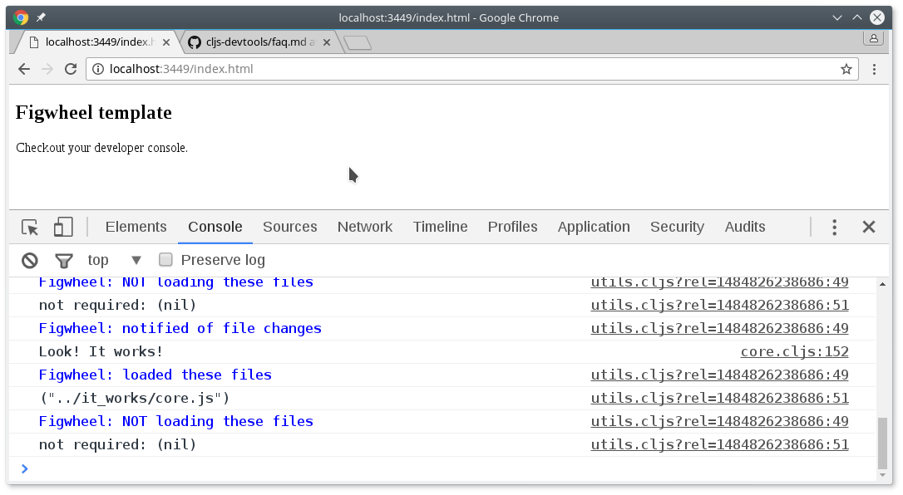
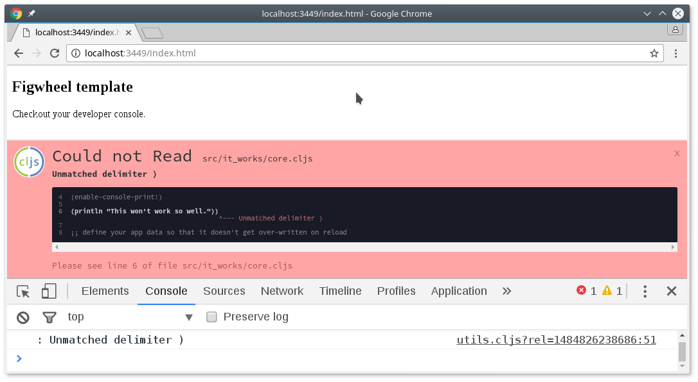

..  Copyright © J David Eisenberg
.. |---| unicode:: U+2014  .. em dash, trimming surrounding whitespace
   :trim:

Appendix C: Creating a ClojureScript Project
::::::::::::::::::::::::::::::::::::::::::::::

At some point you will want to leave the confines of this book’s active code snippets and write a ClojureScript project.
This appendix (to be written) shows you how.

There are two major tools used to create and build projects: Leiningen_ and Boot_\. In this appendix, we will use Leiningen.

.. _Leiningen: https://leiningen.org
.. _Boot: http://boot-clj.com/

To install Leiningen, go to `its website`_ and download and install it per the instructions.

.. _its website: https://leiningen.org

To create a new project with Leiningen, you use a command in the form

::

    lein new template projectname
    
where ``template`` is the name of a project template and ``projectname`` is the name of the project you want to build. The project we will use in this case is the ``figwheel`` project, which creates projects that let you build and test your code in a highly interactive manner. Start with a project named ``it-works``, as follows:

::

    lein new figwheel it-works
    
The last output from this command says:

::

    Change into your 'it-works' directory and run 'lein figwheel'
    Wait for it to finish compiling
    Then open 'http://localhost:3449/index.html' in your browser
    
We’ll come back and do that later, but first, look at the directory structure that the template created:

::

    it-works
    ├── dev
    │   └── user.clj
    ├── project.clj
    ├── README.md
    ├── resources
    │   └── public
    │       ├── css
    │       │   └── style.css
    │       └── index.html
    └── src
        └── it_works
            └── core.cljs

Since figwheel presumes you are building a web application, it has created a the ``resources/public`` directory that holds the web page resources. Your code is in the file ``src/it_works/core.cljs``\. Notice that the project name (``it-works``) has a hyphen, but due to the way that ClojureScript works, the directory name has changed the hyphen to an underscore (``it_works``).

Here are the contents of the ``core.cljs`` file:

::

     1  (ns it-works.core
     2    (:require ))
     3
     4  (enable-console-print!)
     5
     6  (println "This text is printed from src/it-works/core.cljs...")
     7
     8  ;; define your app data so that it doesn't get over-written on reload
     9
    10  (defonce app-state (atom {:text "Hello world!"}))
    11
    12  (defn on-js-reload []
    13    ;; optionally touch your app-state to force rerendering depending on
    14    ;; your application
    15    ;; (swap! app-state update-in [:__figwheel_counter] inc)
    16  )

Lines 1-2
    Establish a *namespace*, a way of grouping variable and function names so that you can use other people’s code without fear of name collisions. The ``:require`` lets you add names of ClojureScript libraries that are needed for this program to run

Line 4
    This lets the ``println`` function print to JavaScript’s console |---| a must for debugging.

Line 6
    This will now show up in the JavaScript console. The text has been shortened here for space considerations.
    
Lines 10-16
    Don’t ask! :) This is fairly advanced stuff, which we may (or may not) cover in other parts of the book.
    
OK, *now* run ``lein fighweel``\. (If you are on Linux, you will want to type ``rlwrap lein figwheel`` to enable the arrow keys in the REPL, which we will discuss later.) The first time you do this, Leiningen will download a whole lot of files that are required for figwheel. Once that is complete, fire up your browser and go to ``http://localhost:3449/index.html`` as instructed. Open the developer console, and you will see something like this:

.. figure:: images/appendix_c/console_output_1.png
   :alt: Console showing output from program
   
   Console output

You can see the text that was in the ``(println)``.  Now, go into the text editor of your choice, and change the ``(println)`` to read as follows::

    (println "Look! It works!")

When you save the file, figwheel will automatically recompile the program and reload it in the browser. Notice that the text in the console has changed:

   
   Updated output
   
Now, make an error on purpose. Change the line to read::

    (println "This won't work so well."))

Then save the file. You will see the error “Unmatched delimiter )” in the browser:

   
   An error display in the browser
   
Once you correct the error and save, figwheel compiles the program, and you will see the Clojure logo appear briefly in the lower left corner of the browser window, indicating a successful compilation.

.. figure:: images/appendix_c/clojure-logo-120b.png
   :alt: Clojure logo; a Greek lambda in a circle
   
Before leaving this topic, bring up the terminal window where you started the ``lein figwheel`` command. You will see a lot of text, ending with this::

    Prompt will show when Figwheel connects to your application
    To quit, type: :cljs/quit
    cljs.user=> 

This is the ClojureScript *REPL*. REPL stands for “Read, Evaluate, Print, Loop”, and it is a way to interactively enter and test ClojureScript. The REPL will *read* your input, *evaluate* it, *print* the result, and then *loop* back to get more input. Try entering some expressions::

    (+ 3 5)
    (* 7 9)
    
Now add a definition to your ``core.cljs`` file and save::

    (defn cube [n] (* n n n))
    
If you try to use it in the REPL, you will get an error::

    cljs.user=> (cube 12)
    ----  Compiler Warning on   <cljs form>   line:1  column:2  ----

    Use of undeclared Var cljs.user/cube

    1  (cube 12)
        ^--- 

    ----  Compiler Warning  ----
    #object[TypeError TypeError: Cannot read property 'call' of undefined]
    nil

Notice the ``cljs.user`` at the prompt? That says you are in the default namespace, and that is why you get the error |---| the ``cube`` function is in the ``it-works`` namespace. You have to swtich to the desired namespace by typing these commands::

    cljs.user=> (require 'it-works.core)
    nil
    cljs.user=> (in-ns 'it-works.core)
    nil
    it-works.core=> (cube 12)
    1728
    it-works.core=> 

The ``(require 'it-works.core)`` loads in the module, and ``(in-ns 'it-works.core)`` switches you to that namespace. You can see that it worked because the prompt changed to ``it-works.core``, and once that occurred, you can now use any of the things you have defined in that namespace, which includes the ``cube`` function.

.. note::

    You might have noticed that there is an opening quote mark but not a closing one in the preceding commands. This is not an error. This is ClojureScript’s way of defining a *symbol*, which is what ``require`` and ``in-ns`` expect as arguments.
    
Once you are finished experimenting with the REPL or using figwheel, type ``:cljs/quit`` in the REPL to return to the command prompt.
