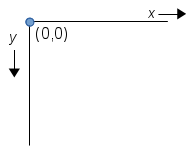

..  Copyright © J David Eisenberg
.. |---| unicode:: U+2014  .. em dash, trimming surrounding whitespace
   :trim:

Drawing on a canvas
''''''''''''''''''''

There are two ways to create graphics in a web page. One is to use `SVG <https://en.wikipedia.org/wiki/Scalable_Vector_Graphics>`_ (scalable vector graphics), and the other is to use the HTML5 ``<canvas>`` element. Although I dearly love SVG, ``<canvas>`` seemed to be a better for this project.

To create a canvas, you need to specify a ``<canvas>`` element with a ``width`` and ``height`` attribute.  You can put text between the opening and closing tags; it will be shown if the browser is unable to display the canvas. The following HTML produces the canvas you will see further down the page (I have enclosed it in a bordered ``
`` so you can see its boundaries more clearly::
  
  <canvas id="drawing1" width="300" height="200">
    Displays a graph of maximum and minimum temperatures.
  </canvas>
  
The coordinate system for a canvas has the origin (0,0) at the upper left corner. The values of *x* increase as you go to the right, and the values of *y* increase as you move downwards, as shown here:
  

Each unit on the canvas corresponds to one pixel. I’ll cover the transformation from cartesian coordinates (on the graph) to canvas coordinates (on the screen) later on, but for now, let’s concentrate on how to draw using the ``<canvas>`` API.  The first thing you need to do is get the *drawing context* for your canvas via the ``getContext`` method:
  
.. activecode:: get_context
  :language: clojurescript
  
  (def canvas (.getElementById js/document "drawing1"))
  (def ctx (.getContext canvas "2d"))
  
The ``getContext`` method takes one argument; in this case, ``"2d"`` to indicate that you are doing two-dimensional graphics.

Here is the canvas:
  
.. raw:: html

  

  <canvas id="drawing1" width="300" height="200">
    Displays a graph of maximum and minimum temperatures.
  </canvas>
  

Once you have the drawing context, you then specify a *path*, which is the set of objects you want to **stroke** (outline) or **fill**.
Let’s create a path for a rectangle and fill it with red:

.. activecode:: draw_rectangle
  :language: clojurescript
  :include: get_context
  
  (set! (.-fillStyle ctx) "rgb(255,0,0)")
  (.beginPath ctx)
  (.rect ctx 100 100 50 30)
  (.fill ctx)

If you wanted an outlined rectangle, you could set the ``.-strokeStyle`` property (the default is black) and then use ``.stroke`` instead of ``.fill``.
The canvas isn’t erased when you run the code, so you may want to move the rectangle to a different location to see the outline effect.

On the next page, you will see a list of methods you can use after you begin a path, and will have a canvas that you can experiment with.
