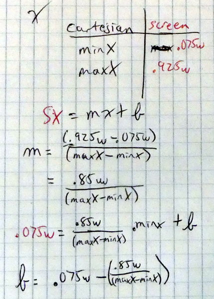
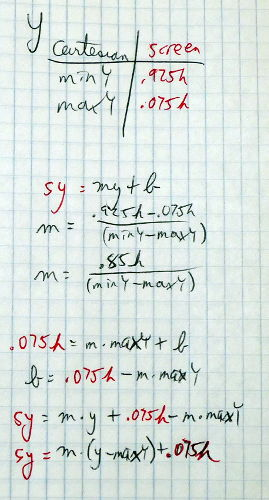

..  Copyright © J David Eisenberg
.. |---| unicode:: U+2014  .. em dash, trimming surrounding whitespace
   :trim:

Converting Coordinates
'''''''''''''''''''''''''

So here’s the next problem to solve: the canvas uses a coordinate system with the *y*-axis whose direction is opposite that of the (cartesian coordinate) graph, and the dimensions of the graph and the canvas are very different.

You also will need some room for the axis labels on the graph. So, what I decided to do was to have a margin that is 7.5% of the height of the canvas at top and bottom, and a margin that is 7.5% of the width of the canvas at the right and left. Given that, how do you convert from graph coordinates to screen coordinates?

Unless you have truly superb powers of visualization and calculation, you probably can’t derive the formulas for this conversion in your head; I certainly couldn’t. When I was young, my mom often would ask me, “Do I need to draw you a diagram?” In this case, the answer is “Yes, I need a diagram |---| with numbers on it |---| to solve this problem.”  Here are the diagrams and the resulting calculations, with the graph coordinates in black and the screen coordinates in red.

.. image:: images/graphing/graph_drawing.jpg
  :alt: Drawing of graph showing both screen and canvas coordinates
    

  

  
What? You were expecting some polished, fancy drawings and beautifully typeset equations? This is me, planning. If I weren’t writing this book, nobody would have seen the derivation of the formulas except me.

I’ll come back to these formulas later during the program. On the next page, I’ll examine the general flow of the program itself.
