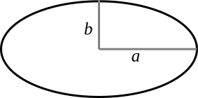
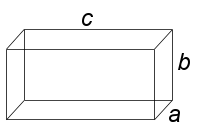

..  Copyright © J David Eisenberg
.. |---| unicode:: U+2014  .. em dash, trimming surrounding whitespace
   :trim:

Writing Your Own Functions
::::::::::::::::::::::::::

These built-in functions (and ClojureScript has many, many more) are all well and good, but I’m guessing you are wondering how you can write your own functions. Wonder no longer; here we go.

The Parts of a Function
========================

Let’s start with implementing an ``average`` function that takes two arguments and yields their average as a result. Here’s the definition:
    
::
    
    (defn average [a b]
      (/ (+ a b) 2.0))

Analyzing this step by step:
    
* ``defn`` is the name of a function that defines functions
* The first argument to ``defn`` is the function name: ``average``
* The next argument is a *vector* of parameter names. A vector is a sequence of items in square brackets. (You will learn more about vectors in *link goes here*.) This function needs two inputs, so there are two items in the vector. In this case, they have generic names: ``a`` and ``b``.
* The last argument to ``defn`` is the *function body.* In this case, it consists of one expression: ``(/ (+ a b) 2.0)``. The last expression in the function body is the function’s result.

Once a function is defined, you can call it just like any other ClojureScript function; you give its name after an opening parenthesis, follow it by the arguments you want to transform, and close the parentheses.

.. activecode:: average_function
    :caption: The average function
    :language: clojurescript
    
    (defn average [a b]
      (/ (+ a b) 2.0))
    
    (average 5 17)

.. reveal:: reveal_params
    :showtitle: Show: What are parameters and arguments?
    :hidetitle: Hide

    You can think of a *parameter* as a placeholder; it’s “extra information” that a function needs to do its job. For example, if I asked you to “calculate the square root,” you would ask me, “The square root *of what*?”  That “what” is a parameter.
    
    When you call the function, you have to provide a value to bind to that placeholder; you have to provide the number whose square root you want. That value is the *argument* to the function.
    
    A **p**\arameter is a **p**\laceholder symbol in the defintion of the function.
    
    An **a**\rgument is the **a**\ctual value that will bind to the placeholder.
                                                                                
    So, in the preceding example, ``a`` and ``b`` are the parameters; when you make the function call, the ``5`` and ``17`` are the arguments whose values will be bound to the parameters.
    
Here’s another function with two parameters; it finds the area of an ellipse as shown in the following figure, using the formula π ∙ a ∙ b:
    

    
    Ellipse with semi-major and semi-minor axis
    
.. activecode:: ellipse_area
    :caption: Calculate area of ellipse
    :language: clojurescript
    
    (defn ellipse-area [a b]
      (* 3.14159265 a b))
    
    (ellipse-area 3 7)
    
Now, you try it. Write a function named ``surface-area`` that calculates the surface area of a rectangular prism with sides of length *a*, *b*, and *c*. The formula is 2(*ab* + *bc* + *ac*).

    
    Rectangular prism

.. container:: full_width

    .. tabbed:: rect_q

        .. tab:: Your Program
        
            .. activecode:: prism
                :language: clojurescript
                
                ; your code here
                
                (surface-area 3 5 7) ; answer should be 142
                
        .. tab:: Answer
            
            .. activecode:: prism_answer
                :language: clojurescript
                
                (defn surface-area [a b c]
                    (* 2 (+ (* a b) (* b c) (* a c))))
                    
                (surface-area 3 5 7)
