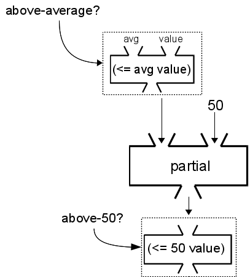

..  Copyright © J David Eisenberg
.. |---| unicode:: U+2014  .. em dash, trimming surrounding whitespace
   :trim:

Manipulating Collections - ``filter``  and ``partial``
::::::::::::::::::::::::::::::::::::::::::::::::::::::

The ``filter`` function processes a collection and yields a sequence of the items that fit certain criteria.


Here is the general form of the ``filter`` function that we will use:

::

    (reduce predicate collection)
    
where

* ``predicate`` is a function that has one parameter: the collection item under consideration
* ``collection`` is the collection to be filtered.

``filter`` applies the ``predicate`` function to each item in the collection. If the function returns ``true``, the item goes into the output sequence, otherwise it doesn’t.

As an example, here is ``filter`` used to extract only numbers that are multiples of four:
    
.. activecode:: filter_fours
    :caption: Filter example
    :language: clojurescript
    
    (defn multiple-of-four? [value]
        (= (rem value 4) 0))
    
    (filter multiple-of-four? [2 16 -3 -72 128 99] )


.. note::
    By convention, boolean functions (functions that return ``true`` or ``false```) have
    names ending with a question mark. Some of the built-in predicates in ClojureScript
    are ``even?``, ``odd?``, ``pos?`` (positive), ``neg?`` (negative), ``zero?``, and ``empty?`` (tests
    if a collection is empty or not).
    
Functions that Create Functions: ``partial``
===============================================

Now, let’s say you wanted to write a filter for a set of scores that keeps only the scores that
are above average.  You have to go through the scores twice: once to find the average, and then
to filter the data that you want. (In computer science, this is called a “two-pass algorithm.”)
You would like to write something like this:
    
::
    
            
    (def scores [81 72 95 84 91 77])

    (defn average [coll]
        (let [n (count coll)
              total (reduce + coll)]
            (if (> n 0) (/ total n) 0)))

    ; this filter function will not work
    (defn above-average? [avg value]
        (> value avg))
        
    (let [avg (average scores)]
        (filter above-average? scores))
    
    
There’s only one problem with this: the predicate function to ``filter`` takes only a single argument, and you need two pieces of information: the current score and the average.  You can’t write the ``above-average?`` function like this:
    
::
    
    (defn above-average? [value]
        (> value avg))
    
because you don’t know the average in advance. You *could* use ``def`` to bind ``avg`` to some value and then change it later with ``set!``, but that goes counter to the principles of functional programming |---| you don’t want to re-bind a symbol to a new value if you don’t have to, and in this case, you don’t have to.

Instead, you can use ``partial``. Before showing you how it is written, here’s the idea behind it. You know how you login to an e-commerce site you’ve used before and you purchase a new item? The checkout form shows up with much of the information already filled in (name, shipping/billing address) and all you need to do is  complete one or two items. In essence, the form is *partially* filled in.

So here’s the trick: we’re going to give ``partial`` the two-parameter function and the first argument. The result will be a partially-called function that is waiting to be called with the second argument, much as the web site sends you a partially-completed form that is waiting to be completed with extra information.

Before doing the whole program, let’s see how you could write a ``partial`` function for filtering averages above 50. I've put the symbols in the expression in ``above-average`` in the same order as the parameters.
    
.. activecode:: avg50
    :caption: Partial function example
    :language: clojurescript

    (defn above-average? [avg value]
        (<= avg value))
        
    (def above-50? (partial above-average? 50))
    
    (above-50? 75)
    
A picture of what’s happening here might be useful:
    

    
Essentially, ``partial`` has constructed a one-parameter function with the 50 “baked in” as the first argument.  Thus, here is the solution for filtering only those scores greater than the average:
    
.. activecode:: partial_avg
    :language: clojurescript
    
    (def scores [81 72 95 84 91 77])

    (defn average [coll]
        (let [n (count coll)
              total (reduce + coll)]
            (if (> n 0) (/ total n) 0)))

    (defn above-average? [avg value]
        (> value avg))
        
    (let [avg (average scores)
          above-calculated-average? (partial above-average? avg) ]
        (filter above-calculated-average? scores))


The key here is ``above-calculated-average? (partial above-average? avg)``. As soon as you *do* know
the average of the scores, you use ``partial`` to provide a new function of one argument that returns
``true`` for values above the ``avg``, which is exactly what ``filter`` requires.

**Exercise** Remember a few pages back where you used ``map`` to calculate a 10% discount on a vector of
prices? This time, you are going to write a program that uses ``map`` to calculate a discount that’s
passed as an argument. Complete this code; you will use ``partial`` to get the job done.
The multi-line quoted string between ``discount`` and its arguments is a conventional way to 
comment a function in ClojureScript.

.. container:: full_width

    .. tabbed:: price_partials

        .. tab:: Your Program

            .. activecode:: price-partials_q
                :caption: Using partial with map
                :language: clojurescript

                (def price-vector [3.95 6.80 2.49 5.33 1.99])
                
                (defn discount
                  "Discount the given price by a percent, which is given as a true
                  percent rather than a decimal. Thus (discount 25 3.50) calculates
                  a 25% discount on an item costing 3.50"
                  [percent price]
                    (* price (- 1 (/ percent 100))))

                (defn calc-discounted-prices
                  "Given a percentage and a vector of prices, create a new
                  sequence with the discounted prices"
                  [percent prices]
                ; your code here
                )
                
                ; calculate 25% discount on the price vector
                (calc-discounted-prices 25 price-vector)

        .. tab:: Answer
        
            .. activecode:: price-partials_answer
                :caption: Mapping a function over a vector
                :language: clojurescript

                (def price-vector [3.95 6.80 2.49 5.33 1.99])
                
                (defn discount
                  "Discount the given price by a percent, which is given as a true
                  percent rather than a decimal. Thus (discount 25 3.50) calculates
                  a 25% discount on an item costing 3.50"
                  [percent price]
                    (* price (- 1 (/ percent 100))))

                (defn calc-discounted-prices
                  "Given a percentage and a vector of prices, create a new
                  sequence with the discounted prices"
                  [percent prices]
                  (let [discount-given-percent (partial discount percent)]
                     (map discount-given-percent prices)))
                
                ; calculate 25% discount on the price vector
                (calc-discounted-prices 25 price-vector)
