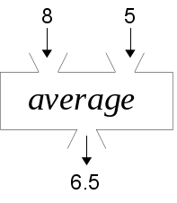

..  Copyright © J David Eisenberg and O'Reilly Media
.. |rs| unicode:: U+2019   .. right single quote
   :trim:
.. |ld| unicode:: U+201C   .. left double quote
   :trim:
.. |rd| unicode:: U+201D   .. right double quote
   :trim:
.. |--| unicode:: U+2013   .. en dash
   :trim:
.. |---| unicode:: U+2014  .. em dash, trimming surrounding whitespace
   :trim:
.. |o| unicode:: U+00B0 .. degree
   :trim:

Functions
:::::::::

The heart of functional programming is, of course, the **function**. Here’s a brief review of what a function is.

Functions as “Black Boxes”
==========================

You can think of a function as a “black box” that takes some input or inputs and provides
some output. Here’s a picture of a black box that adds whatever two numbers come into its input hopper:

.. figure:: images/addition_box.png
   :alt: Box with 3 and 5 as input, 8 as output
   
   Addition as a function box

If you were to write this in a pseudo-mathematical notation, you could write something like this:
    
    *add*\(3, 5) → 8
    
Here’s another black box that finds the average of its inputs:

    

   
   Averaging as a function box
   
In mathematics-like notation, *average*\(8, 5) → 6.5

   
Functions in Functions
======================

If you were to take an X-ray of the average box, you would find that it contains two function boxes inside it:

   
   Inside the averaging box
   
In our pseudo-mathematical notation, using generic variable names instead of 8 and 5, you could write this: *average*\(*a*, *b*) ⇒ *divide*\(*add*\(*a*, *b*), 2).

Before leaving this subject, it’s worth noting that the *add*, *divide* and *average* functions are all **pure functions**; if you give them the same input, you will always, always get the same output. Keeping your functions as pure as possible is a Good Thing™. Yes, there are non-pure functions, and you will see them in upcoming chapters.
