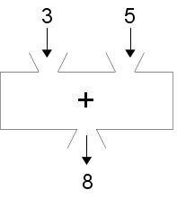

..  Copyright © J David Eisenberg and O'Reilly Media
.. |rs| unicode:: U+2019   .. right single quote
   :trim:
.. |ld| unicode:: U+201C   .. left double quote
   :trim:
.. |rd| unicode:: U+201D   .. right double quote
   :trim:
.. |--| unicode:: U+2013   .. en dash
   :trim:
.. |---| unicode:: U+2014  .. em dash, trimming surrounding whitespace
   :trim:
.. |o| unicode:: U+00B0 .. degree
   :trim:

Functions in ClojureScript
::::::::::::::::::::::::::

So, how do you call functions in ClojureScript? There’s a simple, universal rule: Write an open parenthesis, the name of the function, the function’s arguments, and a closing parenthesis.

Doing Arithmetic with Functions
===============================

Bringing back the addition function box from the previous page:
    

   
   Addition as a function box

If you want to add 3 and 5 in ClojureScript, you write the following *expression*: an open parenthesis, the name of the function (in this case, its name is ``+``\), the arguments, and the closing parenthesis.

.. activecode:: add1
    :caption: Simple Addition
    :language: clojurescript
    
    (+ 3 5)
    
In keeping with the philosophy of this book, you didn’t merely add 3 and 5, you transformed the numbers 3 and 5 into 8 by applying the add function to them. OK, so how would you write an expression that applies the multiply function to the numbers 8 and 9 to get their product? Or, in more ordinary terminology, write an expression that uses the ``*`` function to multiply 8 by 9.
Try it in the active code box below. (Note: the line beginning with ``;`` is a *comment*. Comments are for us humans to read; the computer ignores the semicolon and everything
else on that line.)

.. tabbed:: functions_tab1

.. tab:: Try it

.. activecode:: multiply1
    :caption: Simple Multiplication
    :language: clojurescript
    
    ; Write your code here

.. tab:: Answer

.. activecode:: multiply1_answer
    :caption: Simple Multiplication
    :language: clojurescript
        
    (* 8 9)

In both these cases, it doesn’t matter which order you put the numbers, since addition and multiplication
are commutative (a fancy math term for “order doesn’t matter”). But what about division and subtraction, where order *does* matter? Which number comes first? Try doing a function call using the ``/`` function to divide 8 by 2. Experiment with both orders to see which one gives you the correct answer of 4.

.. activecode:: division1
    :caption: Test Order of Division
    :language: clojurescript

    ; Write your code here
    
.. reveal:: more_about_division
    :showtitle: More about division
    :hidetitle: Hide
    
    In ClojureScript, division is floating point by default. (:doc:`Why do they call it floating point? </floatingpoint>`) If you need to do integer division, use the ``quot`` function. To get the remainder after integer division, use the ``rem`` function.  Thus, ``(quot 35 4)`` is 8, and ``(rem 35 4)`` is 3.

The arithmetic functions can take more than two arguments, so if you need to multiply 7 times 6 times 23, you can write ``(* 7 6 23)``; similarly, ``(+ 10 4 2 11)`` will result in 27. However, what happens if you need to do arithmetic involving more than one operation, such as 3 + 4 * 5? Go to the next page to find out how to do that.

