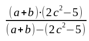

..  Copyright © J David Eisenberg
.. |---| unicode:: U+2014  .. em dash, trimming surrounding whitespace
   :trim:

Local Bindings
:::::::::::::::

You may have noticed that all the functions on the previous page had parameters named ``a`` and ``b``. You may also have wondered how it was possible to use the same symbol in both functions without a conflict.

The reason is that parameters are *local* to the function where they are defined. They “belong” to that function, and that function only. No other function can access those symbols or interfere with them. This is a Good Thing™, because you can give your parameters any names you please with absolute confidence that they will never conflict with the names of parameters in other functions you write or use.

Symbols defined with ``def``, on the other hand, are accessible by any function in the same *namespace* (to be covered in <<xref to come>>), which you may think of as “all my functions” for now.

Local Bindings with ``let``
============================

What if you have a complex calculation that needs to be broken into parts? You can create local bindings inside a function with the ``let`` construct. Here is a formula (not for anything useful; it’s just a good example of an example):
                                                                                                                                                                               

Here is a function to evaluate this formula |---| the hard way.

::
    
    (defn formula [a b c]
      (/ (* (+ a b) (- (* 2 c c) 5)) (-  (+ a b) (- (* 2 c c) 5))))
    
Ye cats. That’s a lot of duplicated effort. You want to calculate ``(+ a b)`` and ``(- (* 2 c c) 5)`` only once, and put the result in temporary bindings. This is what ``let`` allows you to do.

::
    
    (defn formula [a b c]
      (let [expr1 (+ a b)
            expr2 (- (* 2 c c) 5)]
        (/ (* expr1 expr2) (- expr1 expr2))))
      
Going through it step by step:
    
* The opening ``(let``
* ...is followed by a vector that gives symbols and their values. In this example, the symbol ``epxr1``
  is bound to the value ``(+ a b)``, and symbol ``expr2`` is bound to ``(- (* 2 c c) 5)`` By convention,
  each new symbol-and-value pair is on a separate line.
* This is followed by the body of the ``let``...
* ...and the closing parenthesis of the ``let`` clause.

The symbols defined in the ``let`` vector are local to the ``(let...)``. No other function, or even an expression outside the ``let`` in the same function, has access to those bindings.

Try It
------

This example is from the world of accounting. Write a function named ``internal-growth-rate`` that calculates the rate at which a company can grow without requiring external financing.

To calculate this, you need to know three things; these will be the function’s parameters:
    
* The company’s net income
* The company’s total assets
* Dividends that the company pays.

Calculate these things:
   
* The dividend payout ratio, which is dividends divided by net income
* The retention ratio (symbolized by *b*), which is 1 minus the dividend payout ratio
* The return on assets *ROA*, which is net income divided by total assets
* The internal growth rate *IGR* is *ROA* * *b* / (1 - *ROA* * b)

As you can see, there is plenty of use for ``let`` in this function!

.. container:: full_width

    .. tabbed:: igr_q

        .. tab:: Your Program
        
            .. activecode:: igr
                :language: clojurescript
                
                ; your code here
                
                (internal-growth-rate 100000 400000 20000) ; answer should be 0.25
                
        .. tab:: Answer
            
            .. activecode:: igr_answer
                :language: clojurescript
                
                (defn internal-growth-rate [income assets dividends]
                    (let [dividend-ratio (/ dividends income)
                          b (- 1 dividend-ratio)
                          roa (/ income assets)]
                        (/ (* roa b) (- 1 (* roa b)))))
                    
                (internal-growth-rate 100000 400000 20000)

