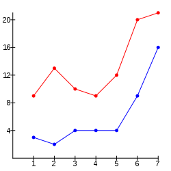

..  Copyright © J David Eisenberg

.. |---| unicode:: U+2014  .. em dash, trimming surrounding whitespace
   :trim:
.. |o| unicode:: U+00B0 .. degree
   :trim:

Preface
'''''''

Explaining the Title
====================

If you are wondering why this book isn’t called *Programming with ClojureScript*, it’s because the book focuses on the main task that programming does |---| transforming data.

Transforming Data
-----------------

Consider this list of minimum and maximum temperatures over a seven-day period in February, 2016 in Tokyo, Japan, using brackets to group each pair of temperatures:  [[3 9] [2 13] [4 10] [4 9] [4 12] [9 20] [16 21]]. You could transform this to find:
    
* The week’s minimum and maximum temperatures: 2 |o| C and 21 |o| C
* The average minimum and maximum temperatures:  13.43 |o| C and 6 |o| C
* The standard deviations: 5.06 and 4.93

You might even transform the data to a set of *x* and *y* coordinates to create a graph:
    

If you think about it, most of what computers do is transformation of data. When you
make an online purchase, the quantity, price, and customer information gets transformed into a record
somewhere in a database. That data gets transformed into purchase orders, receipts, emails, and
a host of other forms. Once you start thinking in terms of transformations, you will see them everywhere.

With ClojureScript
------------------

In the world of mathematics, functions are the tools used to transform data. This is what the **functional
programming** paradigm in the world of programming aims for: to describe algorithms as a series of
functions that transforms input to a desired output.

There are many functional programming languages to choose from, but I decided to go with
ClojureScript_ because it has a simple syntax that is similar to other languages such as Lisp_,
Scheme_, and Racket_, and it compiles to JavaScript_, which is `eating the world`_. 

.. _ClojureScript: https://github.com/clojure/clojurescript
.. _Lisp: https://en.wikipedia.org/wiki/Lisp_%28programming_language%29
.. _Scheme: https://en.wikipedia.org/wiki/Scheme_%28programming_language%29
.. _Racket: http://racket-lang.org/
.. _JavaScript: https://en.wikipedia.org/wiki/JavaScript
.. _eating the world: http://arc.applause.com/2015/11/06/javascript-is-eating-the-world

Who Should Read This Book
=========================

This book may be for you if you are:
    
* a person who has never programmed before
* a beginning programmer
* someone interested in learning what this whole “functional programming” thing is about

Who Should Not Read This Book
=============================

If you are an experienced programmer in functional languages, you will probably find little that is new or exciting here. If your purpose is to learn
ClojureScript, you would do well to look at `ClojureScript Unraveled`_. (Although, if you want to read this book to make comments and/or improvements, please do!)

.. _ClojureScript Unraveled: https://funcool.github.io/clojurescript-unraveled/

Pacing of the Book
==================

For each main topic, my plan is to introduce the topic, give you enough information to get you started using it, then backing up and filling in details to help you use it better.

How to Use This Interactive Book
================================

Because ClojureScript translates to JavaScript, it is possible to make an interactive book that is designed to live on a web site. This book will give you opportunities to try out ClojureScript directly in the browser. For example, you can click
the **Run** button to have ClojureScript add three and five (you’ll see why it’s written this way later on in the book). You can change the numbers,
click **Run** again, and see the results.

.. activecode:: index1
    :language: clojurescript
    
    (+ 3 5)
    
Sometimes I’ll give some extra information that is nice, but not necessary, to know. Click the **Show Further Information** button to see it:
    
.. reveal:: reveal_index
    :showtitle: Show Further Information
    :hidetitle: Hide Further Information
    
    ...and here it is! Once you finish reading the extra material, you can click the hide button to hide it.

Getting the Source
====================

The source files for this book are on GitHub at `<https://github.com/jdeisenberg/icljs>`_ The standard version of Runestone does not allow active code in ClojureScript; if you want to build the book, you will need `this fork of RunestoneComponents`_.

.. _this fork of RunestoneComponents: https://github.com/jdeisenberg/RunestoneComponents

Acknowledgments
=================

Thanks to all the people on the Clojure and ClojureScript IRC and Slack channels who answered my questions and got me unstuck when I went down the wrong path.
