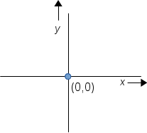

..  Copyright © J David Eisenberg
.. |---| unicode:: U+2014  .. em dash, trimming surrounding whitespace
   :trim:

Projects
:::::::::::
  
Up to this point, for the most part, I’ve thrown a lot of small examples at you to show how specific constructs work. Now it’s time to do a larger program and put some of these things together. The larger program, in this case, will be the program that used this list of mnimum and maximum temperatures::
  
  [[3 9] [2 13] [4 10] [4 9] [4 12] [9 20] [16 21]]

to draw the graph you saw in :doc:`the preface </preface>`:
  
.. image:: images/temperature_graph.png
  :alt: Line graph showing max temperature as red line and min temperature as blue line

  
Planning
============

What will you need to know to draw the graph? Among other things:
  
* How to draw graphs in real life.
* How to represent the data to be graphed.
* The functions you want to write to do the task.
* How to draw on a web page; this will require knowing how to use the JavaScript functions that work with the HTML ``<canvas>`` element.

Drawing a Graph
=================

There’s not much to say here but to review how graphs work in a *Cartesian coordinate system*, where points are described by *x* (horizontal) and *y* (vertical) coordinates. In the classic Cartesian system, the *origin* |---| point (0, 0) is where the *x* and *y* axes meet.

There is no law that says that the origin must be in the dead center of the graph, and, in fact, in the temperature graph, you see that it is near the lower left.

Representing the Data
===========================

When I wrote the original program, it was “custom built” to draw the graph directly from the original vector of vectors. While writing this section of the book, I decided to make the code a bit more general. My design changed from the original design, but that’s OK. Sometimes you write a program, see how it works, realize you could do it better, and do a rewrite.  In this case, rather than simply separate the data into a minimum and maximum vector, I thought it would be better to split the data into vectors that contain both an *x* and *y* coordinate, with the *x* coordinate being a day of the week from 1 to 7. Thus, the original data would split into these two vectors::
  
  [[[1 3] [2 2] [3 4] [4 4] [5 4] [6 9] [7 16]]
   [[1 9] [2 13] [3 10] [4 9] [5 12] [6 20] [7 21]]]

Back in the chapter on :doc:`the reduce function </reduce_multi>`, you developed code to do a simple split into a minimum and maximum vector. Here’s the code again, using destructuring to make the code a bit more readable; see if you can modify it to do what we want here. Hint: start the result vector as ``[[] [] 1]``; the third item keeps count of which day you are working with.
  
.. container:: full_width

    .. tabbed:: split_temperatures_x_y

        .. tab:: Your code

            .. activecode:: split_temperatures_new_q
                :language: clojurescript

                (defn split-temperatures [[min-vec max-vec] [min-temp max-temp]]
                  (vector (conj min-vec min-temp) (conj max-vec max-temp)))
                
                (def temperatures [[3 9] [2 13] [4 10] [4 9] [4 12] [9 20] [16 21]])
                
                (reduce split-temperatures [[] []] temperatures)
        .. tab:: Answer

            .. activecode:: split_temperatures_new_answer
                :language: clojurescript
                
                (defn split-temperatures [[min-vec max-vec day] [min-temp max-temp]]
                    (vector (conj min-vec [day min-temp]) (conj max-vec [day max-temp]) (inc day)))
                
                (def temperatures [[3 9] [2 13] [4 10] [4 9] [4 12] [9 20] [16 21]])
                
                (reduce split-temperatures [[] [] 1] temperatures)
                
In addition to splitting up the data, the program needs functions to:
  
* Draw the axes

  - Draw tick marks on the axes
  - Draw labels near the axes

* Draw a point.
* Draw a line between two points.

All this talk of drawing |---| so how *do* you draw from ClojureScript? You use the API (application program interface) for the ``<canvas>`` element.
