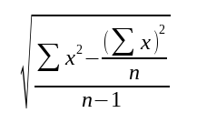

..  Copyright © J David Eisenberg
.. |---| unicode:: U+2014  .. em dash, trimming surrounding whitespace
   :trim:

Manipulating Collections - ``reduce`` 
::::::::::::::::::::::::::::::::::::::

The ``map`` function creates a new sequence with the same number of items as in the original collection. Sometimes, however, you want to process a collection and
get a single item as a result; for example, you might want the minimum or maximum of a list of numbers, their sum (in order to compute the average), or their
sum of squares (to compute standard deviation). This is where the ``reduce`` function comes into play

The ``reduce`` function
=======================

``reduce`` is also a higher-order function; it takes a function as one of its arguments and applies that function to each element of the collection to accumulate a result; that is, it “reduces” the collection to a smaller result (in most cases, a single piece of data).

Here is the general form of the ```reduce`` function that we will use:

::

    (reduce f initial collection)
    
where

* ``f`` is a function that has two parameters: the current accumulated value and the item under consideration
* ``initial`` is the initial value of the accumulated value
* ``collection`` is the collection to be reduced

As an example, here is ``reduce`` used to calculate the sum of squares of a set of numbers:
    
.. activecode:: sum_sq
    :caption: Sum of Squares
    :language: clojurescript
    
    (defn sumsq [result value]
        (+ result (* value value)))
    
    (reduce sumsq 0 [2 3 5])

Here is the sequence of calls and results as ``reduce`` does its job:
    
* ``reduce`` starts by using 0 (the initial value) and 2 (the first item in the collection) as inputs to ``sumsq``. The output of ``(sumsq 0 2)`` is 4.
* That becomes the new *accumulated result*; ``reduce`` will then call ``sumsq`` with 4 and 3 as its inputs.  The output of ``(sumsq 4 3)`` is 13...
* so 13 becomes the result as ``reduce`` calls ``sumsq`` with 13 and 5 as its inputs. The output of ``(sumsq 13 5)`` is 38.
* As the collection has been entirely processed, 38 is returned as the value of the entire call to ``reduce``.

Here’s a video that shows how it works:
    
.. youtube:: QJfz5T8BSmA
    :height: 315
    :width: 560
    :align: center
    
If you do not provide an initial value, ``reduce`` will use the first two values in the collection as input to the reducing function. So, if you
wanted to find the sum of all the values in a vector, you could simply do this. I’m using a longer vector for clarity:
    
.. activecode:: sum_vector
    :caption: Sum a vector
    :language: clojurescript
    
    (reduce + [2 3 7 4])
    
This works because ``+`` is a function that takes two arguments. The sequence of calls and results as ``reduce`` proceeds is:

* The first call to ``+`` is ``(+ 2 3)`` (the first and second items in the collection), resulting in 5.
* The 5 becomes the first argument, and 7 the second argument, giving ``(+ 5 7)``, resulting in 12
* The 12 becomes the first argument and 4 the second argument, giving ``(+ 12 4)``, resulting in 16
* As there are no more items in the collection, the final result of ``reduce`` is 16.

Exercises
=========

**Exercise 1:** Write a program that uses ``reduce`` to find the maximum value in a collection. You will want to use the
no-initial-value version of ``reduce`` here; before you look at any other values, the initial value of the maximum
should be the first item in the collection.

.. container:: full_width

    .. tabbed:: max_value

        .. tab:: Your Program

            .. activecode:: max_value_q
                :language: clojurescript

                (def price-vector [3.95 6.80 2.49 5.33 1.99])
                
                ; your code for function max-value goes here
                
                (reduce max-value price-vector)

        .. tab:: Answer

            .. activecode:: max_value_answer
                :language: clojurescript

                (def price-vector [3.95 6.80 2.49 5.33 1.99])
                
                ; your code for function max-value goes here
                (defn max-value [result value]
                    (if (> value result) value result))
                
                (reduce max-value price-vector)

**Exercise 2:** Write a program that uses ``reduce`` as part of finding the average value of a collection of numbers. Remember that
the ``count`` function tells you how many items are in a collection. If you are handed an empty collection, return 0 as the value for
the average (a reasonable compromise rather than giving an error message).

.. container:: full_width

    .. tabbed:: avg_collection

        .. tab:: Your Program

            .. activecode:: avg_collection_q
                :language: clojurescript

                (def price-vector [3.95 6.80 2.49 5.33 1.99])
                
                ; your code for function average goes here
                
                (average price-vector) ;; should be 4.112

        .. tab:: Answer

            .. activecode:: avg_collection_answer
                :language: clojurescript

                (def price-vector [3.95 6.80 2.49 5.33 1.99])
                
                ; your code for function average goes here
                (defn average [coll]
                    (let [n (count coll)
                          total (reduce + coll)]
                        (if (> n 0) (/ total n) 0)))
                
                (average price-vector)

**Exercise 3:** Write a program that uses ``reduce`` as part of finding the standard deviation of a collection of numbers.
Here is the formula:


   
   Formula for standard deviation

Σx\ :superscript:`2` is the sum of squares; (Σx)\ :superscript:`2` is the sum of the items, squared.
Return zero if there are less than two items in the collection.

.. container:: full_width

    .. tabbed:: stdev_collection

        .. tab:: Your Program

            .. activecode:: stdev_collection_q
                :language: clojurescript

                (def price-vector [3.95 6.80 2.49 5.33 1.99])

                ; your code goes here

                (stdev price-vector) ;; answer should be 1.991788...


        .. tab:: Answer

            .. activecode:: stdev_collection_answer
                :language: clojurescript

                (def price-vector [3.95 6.80 2.49 5.33 1.99])

                ; your code goes here
                (defn sumsq [result value]
                    (+ result (* value value)))

                (defn stdev [coll]
                    (let [n (count coll)
                            sum (reduce + coll)
                            sumsquare (reduce sumsq 0 coll)]
                        (if (> n 1)
                            (.sqrt js/Math (/ (- sumsquare (/ (* sum sum) n))
                                            (- n 1))
                            0))))

                (stdev price-vector)
  

