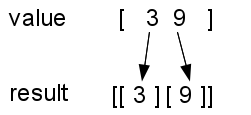
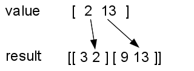

..  Copyright © J David Eisenberg
.. |---| unicode:: U+2014  .. em dash, trimming surrounding whitespace
   :trim:

Manipulating Collections - reduce (part 2)
:::::::::::::::::::::::::::::::::::::::::::::

Let’s return to the formula for standard deviation:

.. figure:: images/stdv.png
   :alt: square root of ((sum of x**2 - ((sum of x)**2 / n) / (n - 1))
   
   Formula for standard deviation

On the preceding page, the solution used ``reduce`` twice; once to find the sum, and again to find the sum of squares. Wouldn’t it be nice if you could get the sum and sum of squares with just one call to ``reduce``?  It would, and you can. There’s no law that says ``reduce`` has to reduce to a single number. It can produce a single *vector* with two elements |---| the sum and the sum of squares:
  
.. activecode:: reduce_sum_sumsq
  :language: clojurescript

  (defn sum-and-sumsq [result value]
      (vector (+ (first result) value)
              (+ (last result) (* value value))))

  (reduce sum-and-sumsq [0 0] [1 3 5 2])
  
First, look at the call to ``reduce``. It follows the established pattern: the arguments are a function ``sum-and-sumsq``, an initial value for the result ``[0 0]``, and the collection to be reduced ``[1 3 5 2]``. The only difference is that the initial value is now a vector, not a single number.

Now, look at the ``sum-and-sumsq`` function. As with the previous examples of ``reduce``, it has two arguments: the accumulated result and an item from the collection. The result of the function is a new vector that adds the value to the ``first`` item in the result and the value squared to the second (``last``) item in the result.

Given this, here is an updated version of the standard deviation calculation:

.. activecode:: reduce_sum_sumsq
  :language: clojurescript

  (def price-vector [3.95 6.80 2.49 5.33 1.99])

  (defn sum-and-sumsq [result value]
      (vector (+ (first result) value)
              (+ (last result) (* value value))))

  (defn stdev [coll]
      (let [n (count coll)
            sums (reduce sum-and-sumsq [0 0] coll)
            sum (first sums)
            sumsquare (last sums)]
           (if (> n 1)
              (.sqrt js/Math (/ (- sumsquare (/ (* sum sum) n))
                              (- n 1))
              0))))

  (stdev price-vector)
  
Remember back in the :doc:`preface </preface>`, where you saw the graph of this vector of high and low temperature sub-vectors (now bound to a symbol)::

    (def temperatures [[3 9] [2 13] [4 10] [4 9] [4 12] [9 20] [16 21]])
    
To create the graph, you will need to split the vector into two vectors: one of
high temperatures and one of low temperatures::

    [[3 2 4 4 4 9 16]
    [9 13 10 9 12 20 21]]
    
Now that you know that ``reduce`` can yield a result of any sort, you can write a function that ``reduce`` will use to split up the tempetature vector.
The result is going to be a vector of two vectors, so the initial result is ``[[][]]``, and the call will be::
  
  (reduce split-temperatures [[][]] temperatures)

Before just starting to write code, again, let’s analyze what needs to happen here. I was trying to describe this in words, and was getting nowhere, until I drew a diagram that shows what happens when the function processes the first two sub-vectors in the ``temperatures`` vector:
  

  
In the preceding image, the first entry in the value (3) is added to the first result vector, and the second entry in the value (9) is added to the second result vector.
  

And, when processing the second item, the first entry in the value (2) is added to the first result vector, and the second entry in the value (13) is added to the second result vector.

Given this information, write the ``split-temperatures`` function. Hint: use ``conj`` to add elements to a vector.

.. container:: full_width

    .. tabbed:: split_temperatures_area

        .. tab:: Your Program

            .. activecode:: split_temperatures__q
                :language: clojurescript

                (defn split-temperatures [result item]
                  ; your code goes here
                  )
                
                (def temperatures [[3 9] [2 13] [4 10] [4 9] [4 12] [9 20] [16 21]])
                
                (reduce split-temperatures [[][]] temperatures)

        .. tab:: Answer

            .. activecode:: split_temperatures_answer
                :language: clojurescript
                
                (defn split-temperatures [result item]
                  (let [min-temp (first item)
                        max-temp (last item)
                        min-vec (first result)
                        max-vec (last result)]
                    (vector (conj min-vec min-temp) (conj max-vec max-temp))))
                
                (def temperatures [[3 9] [2 13] [4 10] [4 9] [4 12] [9 20] [16 21]])
                
                (reduce split-temperatures [[][]] temperatures)