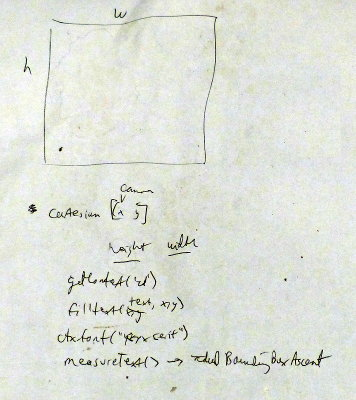
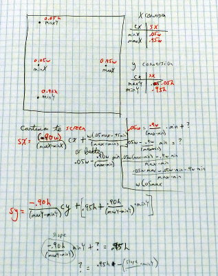

..  Copyright © J David Eisenberg
.. |---| unicode:: U+2014  .. em dash, trimming surrounding whitespace
   :trim:

What Programming is About
:::::::::::::::::::::::::::

Many years ago, I was at a seminar where the leader asked us to describe the essence of
our jobs. After the first participant had
gone on for about a half a minute describing their job, the leader said, “The essence of
your job is: ’I sell things.’” It turned out that nearly everyone could describe the
essence of their job in a short sentence:
    
* I build things.
* I teach.
* I deliver things.

As a programmer, the essence of my job was: “I tell computers how to do things.” Programming is not
ClojureScript; it’s not knowing where to put the parentheses or memorizing a list of functions
built into the language. The language is a *vehicle* to assist you in arriving at your destination:
a program that tells the computer how to do things.

The choice of vehicle often depends on the task at hand. Just as a two-seat convertible is not
the best vehicle for transporting a refrigerator, a language designed to tell computers
how to assemble integrated circuits is probably not the best choice for writing a program to
balance a company’s accounting statements. (It is jokingly said that
if you talk to three programmers, you will get
four mutually contradictory opinions on which programming language is the best vehicle.)

ClojureScript is a general-purpose vehicle that lets you fairly easily describe solutions
to a wide range of problems, which is why it was the choice for this book.

The Process of Programming
============================

Usually, writing a program consists of these steps:
   
1. Figure out what problem you want to solve. No, I’m not kidding. You have no idea how many people start writing a program without really knowing what they want the computer to do.

2. Plan a solution. This should be the part you spend the most time on. This will involve at least figuring out

   * How you want to represent your data
   * What functions you need for transforming the data to arrive at your solution

   It has been only half-jokingly said that “Hours of programming will save you minutes of planning.”
   I realize there is a great temptation to get a half-formed idea of a solution in your head and then
   run to the keyboard and start pounding away. Resist this temptation; such an approach is a waste of time.
   The functional programming style richly rewards pre-planning.

   Realize, however, that your initial design does not have to be your final design. Your planning is not
   engraved in stone; it is engraved in Jell-O®.

3. Now you can start writing your program. Write one function at a time and test as you go.

An Example
===========

I put these steps into practice when I wrote the program to generate the graph in the :doc:`preface </preface>`. First, I had to figure
out the problem I wanted to solve. Why didn’t I use an existing JavaSript charting library and call it from ClojureScript? Wouldn’t that
be easier than “reinventing the wheel”?\ [1]_ Yes, I could have done that, but then you wouldn’t have
really learned much about ClojureScript. Also, I wanted to see if I could do it, and see what interesting problems I ran into along the way, so that
I could include material about that in this book.

.. [1] As `Kyle Simpson`_ commented to me (and I am paraphrasing here), there are lots of different types of wheels. In this case, I was literally making a “training wheel.”

.. _Kyle Simpson: https://blog.getify.com/

So, given that I wanted to write a small graphing program, the next question was how much I wanted it to do. Did I want to write a truly generalized graphing
program, or one that was just good enough to show some interesting constructs of ClojureScript? For the purposes of teaching ClojureScript, the latter was more than
sufficient.

Then came the planning stage. I realized that I would have to translate from cartesian coordinates (the *x* and *y* coordinates you need for a graph like you would
make in an algebra class) and the screen coordinates where the drawing would take place. My first “plan” was a hasty sketch and a couple of notes, as shown in the following image.

    
“OK,” I thought, “I got this.” After fumbling around for twenty minutes and writing some code so dreadful that I won’t show it here, lest it give you any bad habits, I
concluded “No, I don’t got this.” Back to the drawing board, where I drew a diagram **and assigned numbers to the relevant portions**. *Now* I could work on figuring
out the proper formulas, and here is what I came up with:

This time, I drew a detailed diagram, and put numbers with the points on the graph. This gave me a much better idea of what calculations needed to be done, and how to do them.
I also had to decide what data to pre-calculate. Conversion of coordinates for each axis is a linear function. Did I want to calculate the slopes and intercepts once, or do it for every point? What about the width and height of the drawing area, or the maximum and minimum *x*- and *y*-values?  How would I represent a list of points? An undifferentiated list of numbers, or a list consisting of sublists, each one of which contained an *x*- and *y*-coordinate?

Once I finished that, then, and only then, was I ready to begin programming. You’ll see some of the results as examples and exercises as the book proceeds.

